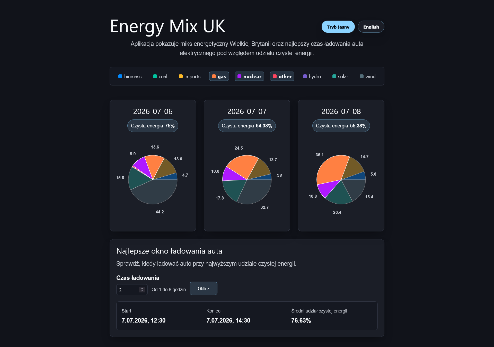

# Energy Mix Frontend

React + TypeScript frontend for the Energy Mix UK app. It shows the UK energy mix, lets users highlight fuels across charts, and calculates the best electric car charging window from backend data.

## App Preview



## Features

- UK energy mix charts with shared fuel legend
- Multiple fuel selection and chart highlighting
- Best charging-window form
- Polish and English language switcher
- Light and dark theme toggle
- Retry action when energy-mix data fails to load

## Requirements

- Node.js 20+
- Backend API running locally or deployed

## Environment

Create `.env` from `.env.example`:

```text
VITE_API_URL=http://localhost:3000
```

`VITE_API_URL` should point to the backend API base URL.

## Install

```bash
npm install
```

## Development

```bash
npm run dev
```

The Vite dev server starts the frontend locally.

## Quality Checks

```bash
npm test
npm run build
npm run lint
npm run format:check
```

## Production Preview

```bash
npm run build
npm run preview
```
